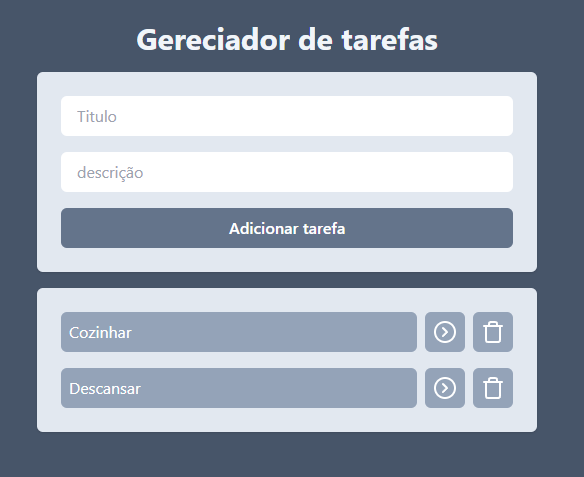

# Gerenciador de Tarefas - React + Vite

Este projeto é um **Gerenciador de Tarefas** desenvolvido com **React** e **Vite**, proporcionando uma estrutura moderna, rápida e prática para o desenvolvimento de interfaces front‑end.

Ele foi desenvolvido como parte de um **curso de React**, com o objetivo de praticar e aplicar conceitos básicos e avançados do framework.

## ⚡️ Tecnologias Utilizadas

- **React** — para construir a interface do usuário.
- **Vite** — para inicialização e build do projeto.
- **JavaScript / JSX** — para lógica e estrutura do app.
- **CSS** — para estilização e layout.

## ✅ Funcionalidades

- Adição de novas tarefas
- Marcação de tarefas como concluídas
- Exclusão de tarefas

## 🚀 Instalação e Execução

1. Clone o repositório:
   ```bash
   git clone https://github.com/seu-usuario/gerenciador-tarefas.git
   ```
2. Instale as dependências:
   ```bash
   npm install
   ```
3. Rode o projeto:
   ```bash
   npm run dev
   ```

## 🌐 Acesse o App

👉 [Gerenciador de Tarefas Online](https://gerenciador-de-tarefas-r41w.vercel.app/)

## 🖼️ Screenshot



## 🏁 Resultado

Um simples e funcional **Gerenciador de Tarefas**, ideal para quem quer aprender e praticar com **React + Vite**.
